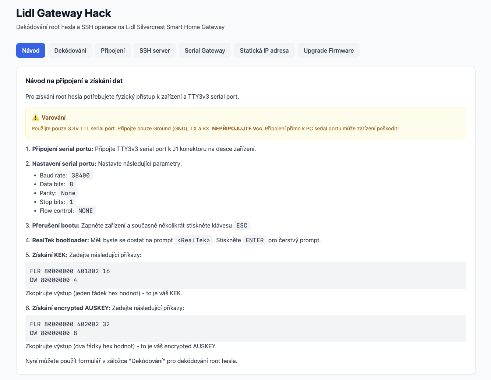

# Lidl Gateway Hack

Webová aplikace pro hackování Lidl Silvercrest Smart Home Gateway zařízení. Umožňuje dekódování root hesla z flash paměti a SSH operace pro modifikaci firmware.



## 📋 Popis

Aplikace poskytuje webové rozhraní pro práci s Lidl Silvercrest Smart Home Gateway zařízeními. Hlavní funkcionalita zahrnuje:

- **Dekódování root hesla**: Získání root hesla z flash paměti zařízení pomocí serial portu
- **SSH operace**: Vzdálené operace na gateway zařízení přes SSH (vypnutí monitoru, nahrání souborů, úprava konfigurace, reboot)

Aplikace je navržena jako náhrada za původní Python skripty (`lidl_auskey_decode_v0.3.py`) a poskytuje uživatelsky přívětivé webové rozhraní s instrukcemi podle oficiálních návodů.

## ✨ Funkce

### Tab 1: Návod
- ✅ **Detailní návod** - Krok za krokem instrukce pro připojení k zařízení a získání KEK a AUSKEY
- ✅ **Varování** - Bezpečnostní upozornění ohledně připojení serial portu

### Tab 2: Dekódování
- ✅ **Dekódování root hesla** - Webový formulář pro dekódování AUSKEY a získání root hesla
- ✅ **Výsledky** - Zobrazení dekódovaného AUSKEY a root hesla

### Tab 3: Připojení
- ✅ **SSH připojení** - Připojení k gateway zařízení přes SSH s možností změny portu
- ✅ **Status indikátor** - Zobrazení aktuálního stavu připojení

### Tab 4: SSH server
- ✅ **Vypnutí SSH monitoru** - Vypnutí monitoru, který blokuje přihlášení
- ✅ **Restart zařízení** - Restartování zařízení s potvrzením

### Tab 5: Serial Gateway
- ✅ **Nahrání souborů** - Nahrání binárních souborů (serialgateway.bin) na zařízení
- ✅ **Úprava konfigurace** - Úprava startovacích skriptů (tuya_start.sh)
- ✅ **Restart zařízení** - Restartování zařízení s potvrzením

### Tab 6: Statická IP adresa
- ✅ **Statická IP** - Nastavení statické IP adresy pro zařízení
- ✅ **Restart zařízení** - Restartování zařízení s potvrzením

### Tab 7: Upgrade Firmware
- ✅ **Upgrade TuYa Zigbee modulu** - Upgrade firmware z verze 6.5.0.0 na 6.7.8.0
- ✅ **Zastavení serialgateway** - Zastavení služby před upgrade
- ✅ **Nahrání upgrade souborů** - Nahrání sx.bin a firmware souboru
- ✅ **Spuštění upgrade** - Provedení upgrade s výběrem EZSP verze (V7/V8)
- ✅ **Obnovení serialgateway** - Obnovení služby po upgrade

## 📖 Použití

### Základní workflow

1. **Dekódování root hesla** (Tab: Návod → Dekódování):
   - Přečtěte si návod v tabu "Návod" pro připojení k zařízení
   - Připojte se k zařízení pomocí TTY3v3 serial portu podle návodu
   - Získejte KEK a encrypted AUSKEY pomocí RealTek bootloaderu
   - Přejděte na tab "Dekódování" a vložte hodnoty do formuláře
   - Dekódujte root heslo

2. **SSH operace** (Tab: Připojení → SSH server / Serial Gateway / Statická IP adresa):
   - Přejděte na tab "Připojení" a připojte se k zařízení přes SSH pomocí získaného root hesla
   - **SSH server**: Vypněte SSH monitor
   - **Serial Gateway**: Nahrajte serialgateway.bin a upravte tuya_start.sh
   - **Statická IP adresa**: Volitelně nastavte statickou IP adresu
   - Restartujte zařízení (tlačítko restartu je dostupné na všech SSH tabech)

3. **Upgrade Firmware** (Tab: Upgrade Firmware):
   - Připojte se k zařízení přes SSH (tab "Připojení")
   - Zastavte serialgateway službu
   - Nahrajte upgrade soubory (sx.bin a firmware .gbl soubor)
   - Spusťte upgrade s výběrem EZSP verze (V7 nebo V8)
   - Po restartu obnovte serialgateway službu

### Reference

- [Návod na modifikaci](https://www.elvisek.cz/2021/08/zigbee-modifikace-lidl-silvercrest-zb-gateway/)
- [Paul Banks - Getting root password](https://paulbanks.org/projects/lidl-zigbee/root/)
- [Paul Banks - Hacking the Gateway](https://paulbanks.org/projects/lidl-zigbee/)

## 🚀 Deployment

### Předpoklady

- Docker a Docker Compose
- Adresář `binaries/` v root projektu s binárními soubory (serialgateway.bin, sx.bin, atd.)

### Příprava binárních souborů

Před spuštěním aplikace vytvořte adresář `binaries/` v root projektu a umístěte tam potřebné soubory:

```bash
# Zkopírujte soubory:
# - serialgateway.bin
# - sx.bin
# - NCP_UHW_MG1B232_678_PA0-PA1-PB11_PA5-PA4.gbl
# - další firmware soubory
```

### Docker Compose

Aplikace je připravena pro spuštění pomocí Docker Compose. Soubor `docker-compose.yml` obsahuje veškerou potřebnou konfiguraci včetně volume mappingu pro binární soubory.

#### Pro vývoj (lokální build)

V `docker-compose.yml` je aktivní `build` sekce (výchozí konfigurace):

**Spuštění:**
```bash
docker compose up -d --build
```

**Rebuild po změnách:**
```bash
docker compose up -d --build
```

Aplikace bude dostupná na `http://localhost:8001` (port 8001 je mapován na port 8000 v kontejneru)

#### Pro produkci (image z GHCR)

V `docker-compose.yml` zakomentujte `build` sekci a odkomentujte `image`:

```yaml
services:
  app:
    # build:
    #   context: .
    #   dockerfile: Dockerfile
    image: ghcr.io/elvisek2020/web-lidl_gateway_hack:latest
```

**Spuštění:**
```bash
docker compose up -d
```

**Update:**
```bash
docker compose pull
docker compose up -d
```

**Poznámka**: Pokud je image **PRIVATE**, je nutné se nejprve autentizovat vůči GHCR:

```bash
echo $GITHUB_TOKEN | docker login ghcr.io -u elvisek2020 --password-stdin
```

#### Konfigurace

Aplikace je konfigurována pomocí `docker-compose.yml`:

```yaml
services:
  app:
    container_name: lidl-gateway-hack
    hostname: lidl-gateway-hack
    restart: unless-stopped
    ports:
      - "8001:8000"
    environment:
      - PYTHONUNBUFFERED=1
      - LOG_LEVEL=INFO  # DEBUG, INFO, WARNING, ERROR, CRITICAL
      - SESSION_SECRET=change-me-in-production
    volumes:
      - ./binaries:/app/binaries:ro
    healthcheck:
      test: ["CMD", "python", "-c", "import urllib.request; urllib.request.urlopen('http://localhost:8000/')"]
      interval: 30s
      timeout: 10s
      retries: 3
      start_period: 40s
```

**Důležité**: Pro produkci změňte `SESSION_SECRET` na bezpečnou hodnotu!

**Poznámka**: Binární soubory v `binaries/` adresáři lze aktualizovat bez rebuildu Docker image - změny se projeví okamžitě díky volume mappingu.

---

## 🔧 Technická dokumentace

### 🏗️ Architektura

Aplikace používá modulární architekturu s následujícími charakteristikami:

- **Backend**: FastAPI s server-side renderingem pomocí Jinja2
- **Frontend**: Tailwind CSS pro styling, HTMX pro dynamické obsahy
- **SSH**: Paramiko knihovna pro SSH operace
- **Kryptografie**: Cryptography knihovna pro dekódování AUSKEY
- **Session management**: Server-side session pro SSH připojení

### Technický stack

**Backend:**

- FastAPI (Python 3.11+)
- Paramiko pro SSH operace
- Cryptography pro dekódování AUSKEY
- Jinja2 pro server-side rendering
- Uvicorn jako ASGI server
- Python logging s konfigurovatelnou úrovní

**Frontend:**

- Vanilla JavaScript (minimální)
- HTML5 + CSS3
- Tailwind CSS (via CDN)
- HTMX pro dynamické obsahy bez reloadu

**Deployment:**

- Docker
- Docker Compose
- Volume mapping pro binární soubory

### 📁 Struktura projektu

```
_docker/
├── app/
│   ├── __init__.py
│   ├── main.py                 # FastAPI aplikace + routy
│   ├── decode.py               # Logika dekódování AUSKEY
│   ├── ssh_operations.py       # SSH operace na gateway
│   └── models.py               # Datové modely (Pydantic)
├── templates/
│   ├── base.html               # Base template s Tailwind CSS, HTMX
│   ├── index.html              # Hlavní stránka s tabs
│   └── partials/               # HTMX partials
│       ├── decode_result.html
│       └── ssh_status.html
├── static/
│   ├── css/
│   │   └── app.css             # Vlastní CSS
│   └── js/
│       └── app.js               # JavaScript pro notifikace
├── requirements.txt            # Python závislosti
├── Dockerfile                  # Docker image definice
├── docker-compose.yml          # Docker Compose konfigurace
├── INSTRUCTION.md              # Detailní instrukce pro vývoj
└── README.md                   # Tato dokumentace
```

### 🔧 API dokumentace

#### Dekódování

**POST** `/api/decode`

- Dekóduje AUSKEY a root password
- Request: `{ "kek": "...", "auskey_line1": "...", "auskey_line2": "..." }`
- Response: HTML partial s výsledky

#### SSH operace

**POST** `/api/ssh/connect`

- Připojí se k SSH serveru
- Request: Form data `{ "host": "...", "port": 22, "password": "..." }`
- Response: HTML partial se statusem

**POST** `/api/ssh/disconnect`

- Odpojí SSH session
- Response: HTML partial se statusem

**GET** `/api/ssh/status`

- Vrací status SSH připojení
- Response: `{ "connected": true/false, "host": "...", "port": 22 }`

**POST** `/api/ssh/disable-monitor`

- Vypne SSH monitor
- Response: HTML partial se statusem

**POST** `/api/ssh/upload-serialgateway`

- Nahraje serialgateway.bin na server
- Request: Form data `{ "filename": "serialgateway.bin" }`
- Response: HTML partial se statusem

**POST** `/api/ssh/update-tuya-start`

- Upraví tuya_start.sh
- Response: HTML partial se statusem

**POST** `/api/ssh/set-static-ip`

- Nastaví statickou IP adresu
- Request: Form data `{ "ip": "10.104.2.22" }`
- Response: HTML partial se statusem

**POST** `/api/ssh/reboot`

- Restartuje zařízení
- Response: HTML partial se statusem

**GET** `/api/files/list`

- Vrací seznam dostupných binárních souborů
- Response: `{ "files": ["serialgateway.bin", "sx.bin", ...] }`

#### Upgrade firmware

**POST** `/api/firmware/stop-serialgateway`

- Zastaví serialgateway službu před upgrade
- Response: HTML partial se statusem

**POST** `/api/firmware/upload-files`

- Nahraje upgrade soubory (sx.bin a firmware .gbl)
- Request: Form data `{ "firmware_filename": "firmware.gbl" }`
- Response: HTML partial se statusem

**POST** `/api/firmware/upgrade`

- Provede upgrade firmware Zigbee modulu
- Request: Form data `{ "firmware_filename": "...", "ezsp_version": "V7" }`
- Response: HTML partial se statusem

**POST** `/api/firmware/restore-serialgateway`

- Obnoví serialgateway službu po upgrade
- Response: HTML partial se statusem

### 💻 Vývoj

#### Přidání nových funkcí

1. **Backend změny**:

   - Přidejte endpoint do `app/main.py`
   - Implementujte logiku v `app/ssh_operations.py` nebo `app/decode.py`
   - Přidejte modely do `app/models.py` pokud potřebujete validaci
2. **Frontend změny**:

   - UI logika: `static/js/app.js`
   - HTML struktura: `templates/index.html`
   - Partials: `templates/partials/`
   - Styly: `static/css/app.css` (používejte box-style komponenty)

#### Debugging

- Nastavte `LOG_LEVEL=DEBUG` v `docker-compose.yml` pro detailní logy
- Server loguje všechny důležité události s timestampy
- Frontend loguje chyby do konzole prohlížeče
- SSH operace mají timeout 30 sekund

#### Úroveň logování (`LOG_LEVEL`)

- `DEBUG` - zobrazí všechny logy včetně detailních debug informací (vývoj)
- `INFO` - zobrazí informační logy (výchozí, vhodné pro testování)
- `WARNING` - zobrazí pouze varování a chyby (doporučeno pro produkci)
- `ERROR` - zobrazí pouze chyby (minimální logování)
- `CRITICAL` - zobrazí pouze kritické chyby

Pro produkci doporučujeme nastavit `LOG_LEVEL=WARNING` nebo `LOG_LEVEL=ERROR`.

### 🎨 UI/UX

Aplikace používá **box-style komponenty** pro konzistentní vzhled:

- Všechny komponenty mají boxový vzhled s rámečky (`bg-white rounded-xl shadow-sm border border-gray-200`)
- Konzistentní barvy a rozestupy
- Responzivní design
- HTMX pro dynamické obsahy bez reloadu stránky
- Notifikace pro uživatelskou zpětnou vazbu

### 🔒 Bezpečnost

- SSH hesla se neukládají persistentně (pouze v server-side session)
- Session timeout: 1 hodina nečinnosti
- Timeout pro SSH operace: 30 sekund
- Validace všech vstupů (IP adresy, porty, hex stringy)
- Sanitizace všech výstupů
- Max velikost uploadu: 10MB
- Binární soubory jsou read-only v Docker volume

### 🐛 Známé problémy

- SSH session se ukládá pouze v paměti serveru - po restartu kontejneru se ztratí
- Pro produkci je nutné změnit `SESSION_SECRET` v `docker-compose.yml`

### 📚 Další zdroje

- [FastAPI dokumentace](https://fastapi.tiangolo.com/)
- [HTMX dokumentace](https://htmx.org/)
- [Tailwind CSS dokumentace](https://tailwindcss.com/)
- [Paramiko dokumentace](https://www.paramiko.org/)
- [Docker dokumentace](https://docs.docker.com/)

## 📄 Licence

Tento projekt je vytvořen pro vzdělávací účely. Původní dekódovací logika je od Banksy (viz `lidl_auskey_decode_v0.3.py`).
